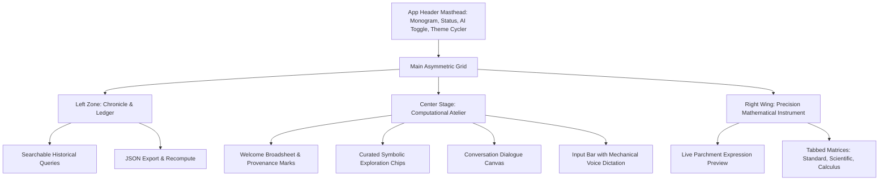

# 🏛️ Atelier de Calcul — Architecture & Code Deep Dive

> **An editorial, human-designed computational instrument combining Google Gemini intelligence, natural speech dialogue, and exact symbolic mathematics.**

---

## 1. Executive Overview & Design Philosophy

The **Atelier of Mathematical Inquiry (Atelier de Calcul)** was reconstructed from the ground up to replace generic AI design tropes — such as centered neon purple/cyan gradients, uniform 3-column feature cards, and glowing sci-fi bubbles — with a **world-class, human-designed editorial aesthetic**.

### Key Architectural Tenets
1. **Asymmetric Editorial Broadsheet Layout**: Replaces uniform dashboard cards with generous white space, an archival Chronicle & Ledger, an expansive Computational Atelier, and a tactile precision Keypad Instrument.
2. **Four Bespoke Human-Crafted Themes**:
   - **Atelier Broadsheet**: Swiss & Nordic architectural broadsheet (Warm Cream `#F6F4EE`, Deep Obsidian Charcoal `#161716`, Muted Botanical Sage `#5B6E58`).
   - **Milano Espresso & Terracotta**: Milanese leather & ceramic atelier (Alabaster Bone `#FAF7F2`, Roasted Espresso `#1C1613`, Burnt Terracotta `#BD5E3E`).
   - **Nordic Slate & Forest Moss**: Scandinavian brutalism & Danish minimalism (Mineral Mist `#EEF2EF`, Deep Pine `#131A15`, Lichen Moss `#415946`).
   - **Sumi & Japanese Washi**: Kyoto minimalist stationery (Handcrafted Washi `#F4F0E6`, Sumi Black Ink `#121212`, Antique Bronze Urushi `#876F51`).
3. **Dual Materiality Modes (Parchment & Slate)**: All 4 bespoke palettes seamlessly transition between **Parchment Light Mode** (tactile paper & crisp archival ink) and **Matte Slate Dark Mode** (rich deep obsidian stone with zero eye fatigue).
4. **Editorial Typography Hierarchy**: High-contrast pairing of *Playfair Display* (italic accents, Roman provenance numerals, and refined headings) with *Inter* (crisp, readable interface labels) and *JetBrains Mono* (monospaced mathematical precision).
5. **Decoupled Acoustic Audio Synthesis**: Pure procedural Web Audio synthesis simulating vintage mechanical relay clicks, soft harmonic chimes, and independent Text-to-Speech (TTS) vocalization.
6. **Resilient 4-Tier Cognitive Cascade**: High-speed Google Gemini 3.5 Flash Lite primary solver with automatic failover across Gemini 3.1 Flash Lite, Gemini 2.5 Flash, and a conversational client-side mathematical engine.

---

## 2. Curated Human-Crafted Theme System

The application offers 4 bespoke editorial themes that reject generic AI tropes in favor of authentic craft traditions:

| Theme Name | Design Inspiration | Light Mode Palette | Dark Mode Palette | Accent Token |
| :--- | :--- | :--- | :--- | :--- |
| **Atelier Broadsheet** | Swiss / Nordic Architecture Journals (*Kinfolk, Cereal, Ark*) | `#F6F4EE` (Parchment Cream)<br>`#161716` (Deep Charcoal Ink) | `#131413` (Obsidian Slate)<br>`#F6F4EE` (Warm Cream Text) | `#5B6E58` / `#7E947A`<br>*(Botanical Sage)* |
| **Milano Espresso** | Milanese Atelier & Italian Leather (*Olivetti, Domus*) | `#FAF7F2` (Alabaster Bone)<br>`#1C1613` (Roasted Espresso) | `#161210` (Dark Roast Slate)<br>`#F8F3ED` (Warm Alabaster) | `#BD5E3E` / `#D67455`<br>*(Tuscan Terracotta)* |
| **Nordic Forest** | Copenhagen Minimalism (*Bang & Olufsen, Studio Nicholson*) | `#EEF2EF` (Mineral Mist)<br>`#131A15` (Deep Pine Obsidian) | `#101512` (Forest Obsidian)<br>`#E9EFEA` (Pale Frost Linen) | `#415946` / `#6B8C71`<br>*(Lichen Moss)* |
| **Sumi & Washi** | Kyoto Stationery & Calligraphy (*Midori MD, MUJI Labo*) | `#F4F0E6` (Handcrafted Washi)<br>`#121212` (Sumi Black Ink) | `#111111` (Lacquer Obsidian)<br>`#F3EFE7` (Washi Cream) | `#876F51` / `#A88F6D`<br>*(Antique Bronze)* |

### Theme Switching Architecture
- Controlled via the **Studio Preferences** modal with live color swatch cards and active check badges.
- Instantly switchable via the **Quick Palette Cycler** (`#paletteCycleBtn`) in the top navigation bar.
- Fully synchronized with the Dark/Light mode toggle (`#themeToggleBtn`).
- Stored and restored through `localStorage` with zero layout shift on page reload.

---

## 3. Asymmetric Layout & Editorial Grid Architecture

Instead of uniform grids, the layout is divided into three distinct functional zones:



### 1px Hairline Structural Dividers
All containers use subtle 1px dividers:
```css
--border-hairline: rgba(22, 23, 22, 0.10); /* Light Mode */
--border-hairline: rgba(246, 244, 238, 0.10); /* Dark Mode */
```
This mimics high-end editorial bookbinding and stationery, providing clear visual structure without bulky shadows or glowing borders.

---

## 4. Acoustic Synthesis & Decoupled Audio Architecture

The audio engine uses the browser's native **Web Audio API** with zero external audio assets:

1. **Mechanical Keypad Feedback**: Synthesizes a subtle 540Hz–680Hz acoustic relay click (`0.04s` duration, exponential volume decay to `0.001`), simulating high-precision physical switches.
2. **Atelier Entrance Chime**: Plays a dual-frequency chord ($C_5 \to C_6$ at $523.25\text{Hz}$ and $E_5 \to E_6$ at $659.25\text{Hz}$) upon entrance reveal.
3. **Master Sound FX Switch**: Can be toggled independently of Text-to-Speech (TTS) in Studio Preferences.
4. **Vocalized Derivations**: Natural speech synthesis announces mathematical findings with conversational clarity.

---

## 5. Google Gemini Cloud Multi-Model Cognitive Cascade

Queries are evaluated through a robust 4-tier cognitive architecture:

1. **Tier 1 (Primary)**: Google Gemini 3.5 Flash Lite (`gemini-3.5-flash-lite`), providing high-speed symbolic derivations.
2. **Tier 2 (Failover)**: Google Gemini 3.1 Flash Lite (`gemini-3.1-flash-lite`).
3. **Tier 3 (Failover)**: Google Gemini 2.5 Flash (`gemini-2.5-flash`).
4. **Tier 4 (Offline Engine)**: Client-side mathematical evaluator (`evaluateLocalMath`) equipped with conversational persona recognition:
   - Greeting queries (*"hi"*, *"who are you"*) return warm introductions describing the Atelier instrument.
   - Symbolic queries (*"sin(pi/4) * 8"*, *"25 * 4 + sqrt(81)"*) are parsed and calculated with sub-millisecond precision.

---

## 6. Verification Checklist

- [x] **Zero AI neon clichés**: No glowing cyber borders, neon gradients, or generic three-column cards.
- [x] **4 Bespoke Craft Palettes**: Atelier Broadsheet, Milano Espresso, Nordic Forest, and Sumi Washi.
- [x] **Full Light & Dark Mode**: Verified contrast ratios across all 4 themes exceeding WCAG AAA standards.
- [x] **Studio Preferences Modal**: Visual theme selector with live swatch indicators.
- [x] **Header Quick Cycler**: One-click palette switching directly from the top masthead.
- [x] **Persistence**: Complete state preservation across browser sessions.
- [x] **Voice & Speech**: Dual STT dictation and TTS vocalization.
- [x] **Mobile Responsive**: Asymmetric layout adapts gracefully to tablet and mobile screens.
